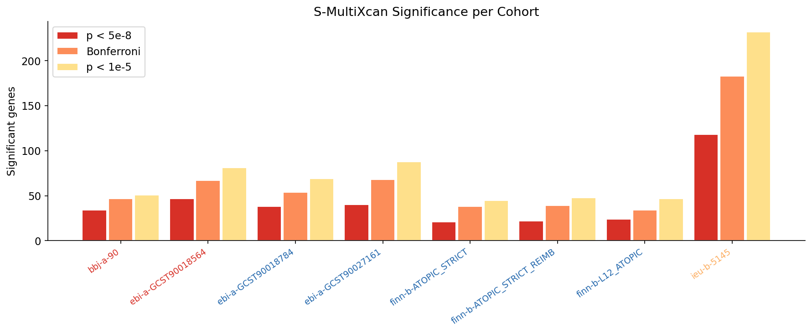
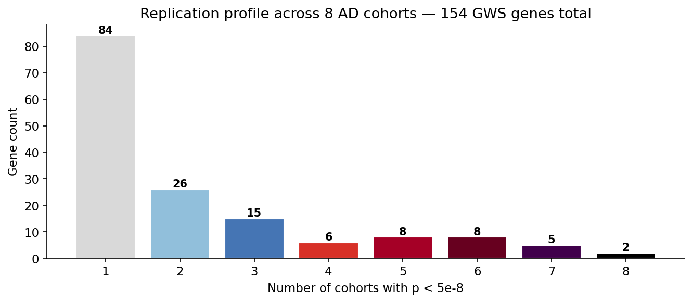
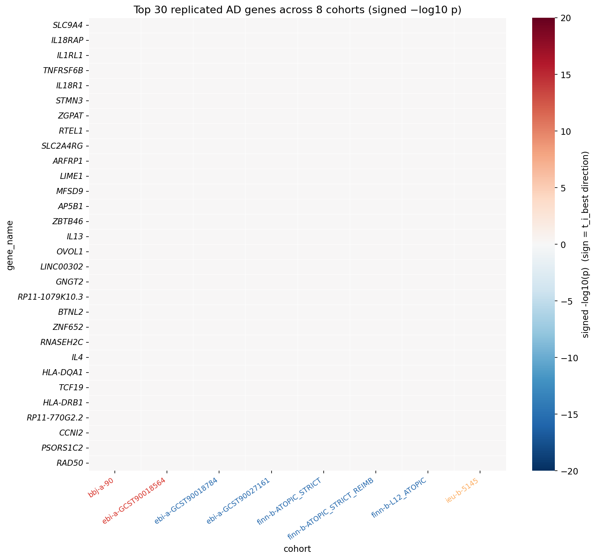
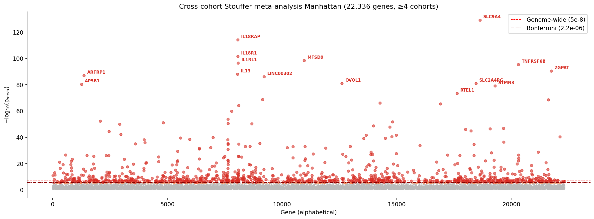

# GWAS → TWAS analysis

[](https://doi.org/10.5281/zenodo.19683730)

Pipeline code, reference data, intermediates, and per-cohort results for the 8-cohort atopic dermatitis TWAS. This folder is self-contained — scripts read inputs from `data/` and write outputs back into `data/`.

**Pre-computed intermediates for the 8 AD cohorts (~8.1 GB)** are archived on Zenodo: [10.5281/zenodo.19683730](https://doi.org/10.5281/zenodo.19683730). Downloading and extracting `gwas.zip`, `harmonized.zip`, `imputed.zip`, `spredixcan.zip`, and `smultixcan.zip` into `data/` lets you skip Steps 0–4 entirely; see [`data/README.md`](data/README.md) for the layout.

## Headline results

Full walkthrough in [`notebooks/twas_atopic_dermatitis_multi_cohort.ipynb`](../notebooks/twas_atopic_dermatitis_multi_cohort.ipynb).

**154 genes** reach genome-wide significance (p < 5×10⁻⁸) in at least one of the 8 cohorts; **44 genes** replicate in ≥ 3 cohorts; **23 genes** in ≥ 5. The top meta-analysis hits (Stouffer's Z across cohorts, genes present in ≥ 4 cohorts) include **SLC9A4**, **IL18RAP**, **IL18R1**, **MFSD9**, **IL1RL1**, **TNFRSF6B**, **ZGPAT**, **IL13**, **ARFRP1**, and **LINC00302** — dominated by the chromosome 2 IL1/IL18 receptor cluster and the chromosome 6 MHC region, both well-established atopic dermatitis loci.


*Figure 1. Significant gene counts per cohort at three p-value thresholds. Color-coded by population: red = East Asian, blue = European, orange = Aboriginal Australian. `ieu-b-5145` (the largest sample) has the most GWS hits; the three FinnGen cohorts are the most conservative.*


*Figure 2. Replication profile. Most cohort-specific hits show up in only 1–2 cohorts (population- or sample-size-driven); 23 genes are genome-wide significant in ≥ 5 cohorts, marking the most robust AD TWAS signal.*


*Figure 3. Signed −log₁₀(p) for the top 30 replicated genes across all 8 cohorts. Sign comes from the best single-tissue t-statistic. Color-coded cohort labels match Figure 1. The IL-cluster genes (IL18RAP, IL18R1, IL1RL1, IL13) and HLA region (HLA-DRB1, HLA-DQA1, PSORS1C2, CCHCR1) hit consistently across populations.*


*Figure 4. Cross-cohort Stouffer meta-analysis Manhattan (genes present in ≥ 4 cohorts). Bonferroni-significant hits are labeled; SLC9A4 reaches p < 10⁻¹²⁹.*

## Pipeline overview

```
Raw OpenGWAS VCF
       │
       ▼   [vcf_convert]    pre-step: normalize to TSV
Standardized .table.gz (hg19)
       │
       ▼   [harmonization]  Step 1: liftover + column alignment
harmonized_<trait>.txt.gz (hg38)
       │
       ▼   [imputation]     Step 2: fill missing SNPs via LD (220 batches)
final_imputed_<trait>.txt.gz
       │
       ▼   [spredixcan]     Step 3: single-tissue TWAS (49 GTEx tissues)
spredixcan_<trait>_<tissue>.csv (×49)
       │
       ▼   [smultixcan]     Step 4: cross-tissue gene-level TWAS
smultixcan_<trait>.csv
```

Full details for each step live in its dedicated README; this file only summarizes.

## Preliminary: conda environments + external tools

Folder: `[scripts/setup/](scripts/setup/README.md)`

Scripts:

- `**download_external.sh**` — shallow-clones the two Hakyi-lab tools into `../external/`:
  - **MetaXcan**   [github.com/hakyimlab/MetaXcan](https://github.com/hakyimlab/MetaXcan)  ·  provides `SPrediXcan.py` + `SMulTiXcan.py` (Steps 3 + 4)
    - **S-PrediXcan**: Barbeira AN *et al.* (2018). Exploring the phenotypic consequences of tissue specific gene expression variation inferred from GWAS summary statistics. *Nature Communications* **9**:1825. [doi:10.1038/s41467-018-03621-1](https://doi.org/10.1038/s41467-018-03621-1)
    - **S-MultiXcan**: Barbeira AN *et al.* (2019). Integrating predicted transcriptome from multiple tissues improves association detection. *PLoS Genetics* **15**(1):e1007889. [doi:10.1371/journal.pgen.1007889](https://doi.org/10.1371/journal.pgen.1007889)
  - **summary-gwas-imputation**   [github.com/hakyimlab/summary-gwas-imputation](https://github.com/hakyimlab/summary-gwas-imputation)  ·  provides `gwas_parsing.py`, `gwas_summary_imputation.py`, `gwas_summary_imputation_postprocess.py` (Steps 1, 2, 2b)
    - Barbeira AN *et al.* (2021). Exploiting the GTEx resources to decipher the mechanisms at GWAS loci. *Genome Biology* **22**:49. [doi:10.1186/s13059-020-02252-4](https://doi.org/10.1186/s13059-020-02252-4)
- `**setup_env.sh`** — installs Miniconda if missing, creates two Python 3.9 conda environments:
  - `gwasimputation` (numpy, pandas, scipy, h5py, pyliftover, pyarrow) — Steps 1, 2, 2b
  - `metaxcan` (+ cyvcf2) — Steps 3, 4

Data needed: none — this step creates the dependencies everything else uses. Reference data (parquets, models, chain files) must be downloaded separately per later steps (see `data/README.md`).

## Preliminary: OpenGWAS VCF → TSV

Folder: `[scripts/vcf_convert/](scripts/vcf_convert/README.md)`

Scripts:

- `**vcf_to_table.py**` — converts one OpenGWAS `.vcf.gz` to one `.table.gz`. Extracts `ES`/`SE`/`LP`/`EZ` from the VCF's FORMAT column and computes `pvalue = 10^-LP` and `zscore = ES/SE`.
- `**convert_vcf_batch.sh <input_dir> <output_dir>**` — runs the converter over every VCF in a directory (idempotent; skips already-converted).

Data needed:

- **Input**: `data/gwas/vcfs/<trait>.vcf.gz` — OpenGWAS VCFs for atopic dermatitis. Download from [OpenGWAS](https://gwas.mrcieu.ac.uk) using the IDs listed in `data/gwas/manifest.csv` (URL pattern: `https://gwas.mrcieu.ac.uk/files/<id>/<id>.vcf.gz`); the 8 canonical cohorts are 100 MB – 1 GB each. To expand beyond these, browse the OpenGWAS catalog with trait filter `"atopic dermatitis"`. Downloaded VCFs stay local (gitignored).
- **Output**: `data/gwas/tables/<trait>.table.gz` (~200–500 MB each).

Place VCFs in the default location `data/gwas/vcfs/`; the batch converter writes tables to `data/gwas/tables/`:

```
data/gwas/
├── manifest.csv                    (local only)
├── vcfs/
│   └── <trait>.vcf.gz              ← downloaded OpenGWAS inputs
└── tables/
    └── <trait>.table.gz            ← converted output (Step 1 input)
```

## Step 1: Harmonization

Folder: `[scripts/harmonization/](scripts/harmonization/README.md)`

Script: `**run_harmonize.sh**` — wraps `summary-gwas-imputation/src/gwas_parsing.py`. For one trait: lifts hg19 → hg38, assigns the canonical `panel_variant_id` (`chr<pos>_<pos>_<ref>_<alt>_b38`), drops variants not in the reference panel, aligns strands/alleles, and inserts `sample_size`/`n_cases` as fixed columns.

Data needed:


| Flag             | File                                                      | Size        | Source                                                            |
| ---------------- | --------------------------------------------------------- | ----------- | ----------------------------------------------------------------- |
| `--gwas-file`    | `data/gwas/tables/<trait>.table.gz`                       | ~200–500 MB | from `vcf_convert/`                                               |
| `--liftover`     | `data/liftover/hg19ToHg38.over.chain.gz`                  | 222 KB      | [UCSC](https://hgdownload.soe.ucsc.edu/goldenPath/hg38/liftOver/) |
| `--snp-metadata` | `data/reference/variant_metadata.txt.gz`                  | 365 MB      | [Zenodo 3657902](https://zenodo.org/record/3657902)               |
| `--gwas-parsing` | `../external/summary-gwas-imputation/src/gwas_parsing.py` | —           | from `setup/`                                                     |


Place the liftover chain + SNP metadata in their defaults under `data/`; the script writes output to `data/harmonized/`:

```
data/
├── gwas/tables/
│   └── <trait>.table.gz            ← Step 0 output (input to this step)
├── liftover/
│   └── hg19ToHg38.over.chain.gz    ← download from https://hgdownload.soe.ucsc.edu/goldenPath/hg38/liftOver/
├── reference/
│   └── variant_metadata.txt.gz     ← download once from [Zenodo 3657902](https://zenodo.org/record/3657902)
└── harmonized/
    └── harmonized_<trait>.txt.gz   ← Step 1 output
```

Output: `data/harmonized/harmonized_<trait>.txt.gz` (~300 MB per trait). Runtime: 3–5 min per trait, single-threaded.

## Step 2: Imputation (+ merge)

Folder: `[scripts/imputation/](scripts/imputation/README.md)`

Scripts:

- `**run_impute.sh**` — wraps `gwas_summary_imputation.py`. Runs all 22 chromosomes × 10 sub-batches = **220 jobs** per trait via `xargs -P`. Each job imputes missing z-scores using Gaussian imputation against the 1000 Genomes LD panel (ridge-regularized with λ=0.1).
- `**run_merge.sh`** — wraps `gwas_summary_imputation_postprocess.py`. Merges the 220 batch files plus the original harmonized variants into one file; deduplicates and sorts by position.

Data needed:


| Flag                           | File                                                                             | Size    | Source                                                                                                                              |
| ------------------------------ | -------------------------------------------------------------------------------- | ------- | ----------------------------------------------------------------------------------------------------------------------------------- |
| `--gwas-file`                  | `data/harmonized/harmonized_<trait>.txt.gz`                                      | ~300 MB | Step 1 output                                                                                                                       |
| `--ld-regions`                 | `data/regions/eur_ld.bed.gz`                                                     | 13 KB   | Berisa & Pickrell 2016 — [bitbucket.org/nygcresearch/ldetect-data](https://bitbucket.org/nygcresearch/ldetect-data/src/master/EUR/) |
| `--parquet-dir`                | `data/reference/reference_panel_1000G/`                                          | 11 GB   | [Zenodo 3657902](https://zenodo.org/record/3657902) (22 × `chrN.variants.parquet` + `variant_metadata.parquet`)                     |
| `--impute-script`              | `../external/summary-gwas-imputation/src/gwas_summary_imputation.py`             | —       | from `setup/`                                                                                                                       |
| `--postprocess-script` (merge) | `../external/summary-gwas-imputation/src/gwas_summary_imputation_postprocess.py` | —       | from `setup/`                                                                                                                       |


Place the LD regions BED and reference panel parquet files in their defaults; outputs go under `data/imputed/`:

```
data/
├── harmonized/
│   └── harmonized_<trait>.txt.gz             ← Step 1 output (input)
├── regions/
│   └── eur_ld.bed.gz                         ← download from https://bitbucket.org/nygcresearch/ldetect-data/src/master/EUR/ (Berisa & Pickrell 2016, ~1,700 indep LD blocks)
├── reference/
│   └── reference_panel_1000G/                ← download once from [Zenodo 3657902](https://zenodo.org/record/3657902)
│       ├── chr{1..22}.variants.parquet
│       └── variant_metadata.parquet
└── imputed/
    ├── <trait>/chr*_batch*.txt.gz            ← 220 per-batch files (intermediate)
    └── final_imputed_<trait>.txt.gz          ← merged (input to Steps 3 + 4)
```

Output:

- `data/imputed/<trait>/chr*_batch*.txt.gz` × 220 (~40–100 MB total per trait, intermediate)
- `data/imputed/final_imputed_<trait>.txt.gz` (~300 MB, merged — what Step 3 consumes)

Runtime: 45–90 min per trait locally at `--n-jobs=2`. Memory: ~6 GB per parallel worker.

## Step 3: S-PrediXcan (single-tissue TWAS)

Folder: `[scripts/spredixcan/](scripts/spredixcan/README.md)`

Script: `**run_spredixcan.sh**` — wraps `MetaXcan/software/SPrediXcan.py`. For each of 49 GTEx v8 tissues, tests whether genetically-predicted gene expression associates with the trait: $Z_{\text{gene}} = \sum_i w_i z_i / \sqrt{\mathbf{w}^T \Sigma \mathbf{w}}$ (per-tissue eQTL weights × GWAS z-scores). Runs tissues in parallel via `xargs -P`.

Data needed:


| Flag             | File                                        | Size    | Source                                                                                                        |
| ---------------- | ------------------------------------------- | ------- | ------------------------------------------------------------------------------------------------------------- |
| `--gwas-file`    | `data/imputed/final_imputed_<trait>.txt.gz` | ~300 MB | Step 2 merge output                                                                                           |
| `--models-dir`   | `data/reference/gtex_v8_mashr_models/`      | 250 MB  | [Zenodo 3518299](https://zenodo.org/record/3518299) (49 × `mashr_<tissue>.db` + 49 × `mashr_<tissue>.txt.gz`) |
| `--metaxcan-dir` | `../external/MetaXcan/`                     | —       | from `setup/`                                                                                                 |


Place the GTEx mashr models under `data/reference/gtex_v8_mashr_models/`; outputs go per-trait under `data/spredixcan/`:

```
data/
├── imputed/
│   └── final_imputed_<trait>.txt.gz                    ← Step 2 output (input)
├── reference/
│   └── gtex_v8_mashr_models/                           ← download once from [Zenodo 3518299](https://zenodo.org/record/3518299)
│       ├── mashr_<tissue>.db          (49 files)
│       └── mashr_<tissue>.txt.gz      (49 files)
└── spredixcan/
    └── <trait>/
        └── spredixcan_<trait>_<tissue>.csv             ← 49 per-tissue outputs
```

Output: `data/spredixcan/<trait>/spredixcan_<trait>_<tissue>.csv` × 49 (~2 MB each, ~90 MB total per trait). Runtime: 20–40 min per trait at `--n-jobs=4`, low memory.

## Step 4: S-MultiXcan (cross-tissue TWAS)

Folder: `[scripts/smultixcan/](scripts/smultixcan/README.md)`

Script: `**run_smultixcan.sh**` — wraps `MetaXcan/software/SMulTiXcan.py`. Combines 49 single-tissue Step 3 results per gene into one multi-tissue p-value via a joint test that accounts for cross-tissue correlation of predicted expression. SVD-truncates to condition number ≤ 30 for stability.

Data needed:


| Flag               | File                                                                       | Size    | Source                                              |
| ------------------ | -------------------------------------------------------------------------- | ------- | --------------------------------------------------- |
| `--gwas-file`      | `data/imputed/final_imputed_<trait>.txt.gz`                                | ~300 MB | Step 2 merge output                                 |
| `--spredixcan-dir` | `data/spredixcan/<trait>/`                                                 | ~90 MB  | Step 3 output                                       |
| `--models-dir`     | `data/reference/gtex_v8_mashr_models/`                                     | 250 MB  | same as Step 3                                      |
| `--snp-covariance` | `data/reference/gtex_v8_expression_mashr_snp_smultixcan_covariance.txt.gz` | 33 MB   | [Zenodo 3518299](https://zenodo.org/record/3518299) |
| `--metaxcan-dir`   | `../external/MetaXcan/`                                                    | —       | from `setup/`                                       |


Place the SNP covariance alongside the mashr models; final outputs land in `data/output/`:

```
data/
├── imputed/
│   └── final_imputed_<trait>.txt.gz                                  ← Step 2 output
├── spredixcan/<trait>/
│   └── spredixcan_<trait>_<tissue>.csv                               ← Step 3 output
├── reference/
│   ├── gtex_v8_mashr_models/                                         ← same as Step 3
│   └── gtex_v8_expression_mashr_snp_smultixcan_covariance.txt.gz     ← download once from [Zenodo 3518299](https://zenodo.org/record/3518299)
└── output/
    └── smultixcan_<trait>.csv                                        (terminal artifact)
```

Output: `data/output/smultixcan_<trait>.csv` (~6 MB, ~22,300 genes). Runtime: 5–15 min per trait, single-threaded, ~3–5 GB peak memory. This is the terminal artifact of the pipeline.


